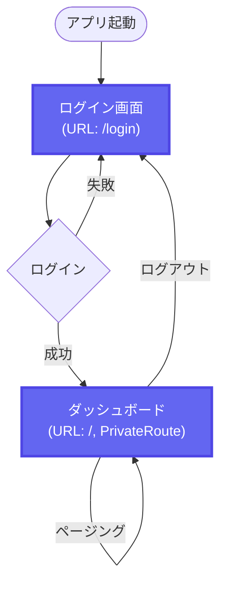
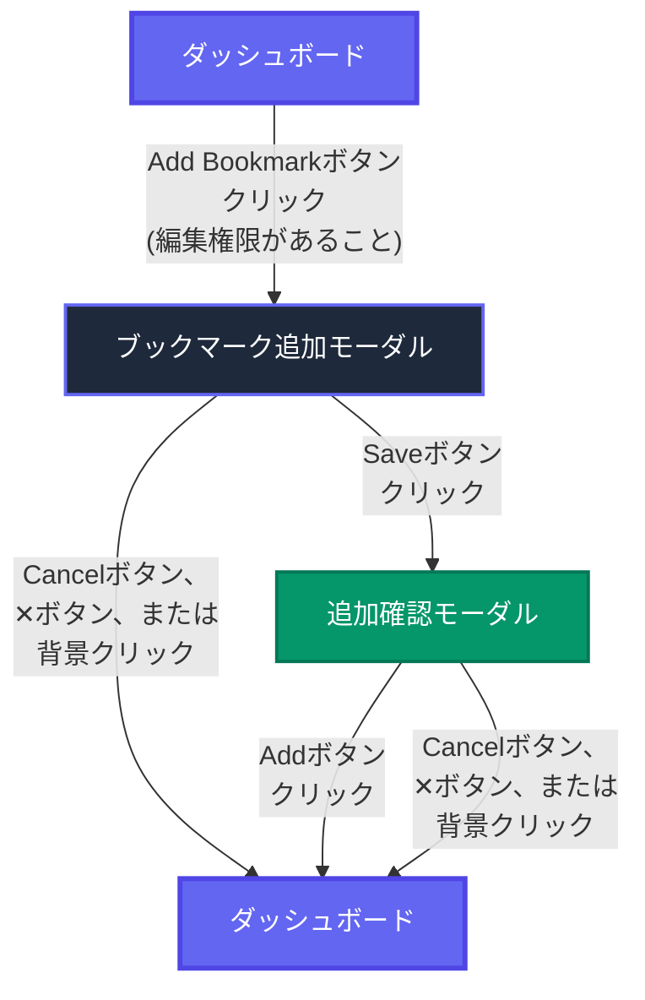
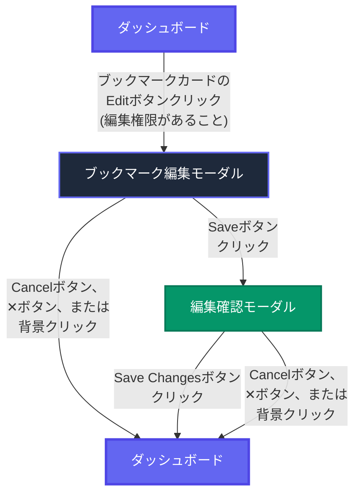
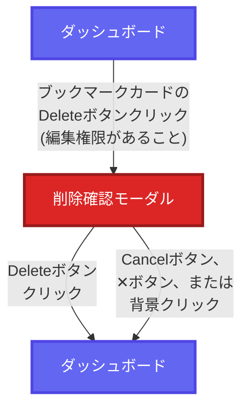

# 画面遷移図

このドキュメントは、bookmark-web-frontendアプリケーションの画面遷移を示すMermaid図です。

## 1. メイン画面遷移

---

## 2. ブックマーク追加フロー

---

## 3. ブックマーク編集フロー

---

## 4. ブックマーク削除フロー

---

## 凡例

| 色 | 用途 |
|---|---|
| 🟦 **青色** | メイン画面 (ログイン画面、ダッシュボード) |
| 🟪 **紫色** | 入力モーダル (ブックマーク追加・編集) |
| 🟢 **緑色** | 確認モーダル (追加・編集の確認) |
| 🟥 **赤色** | 削除確認モーダル |

